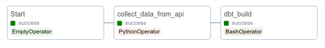
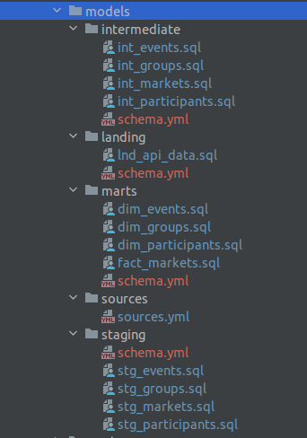
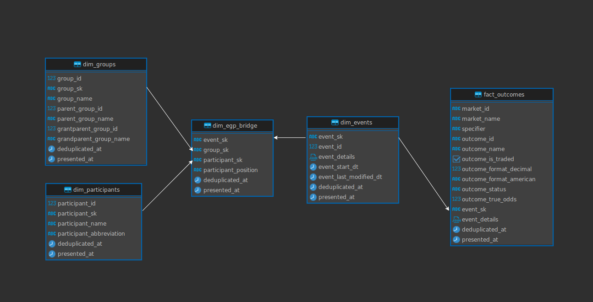

# DM-Home-Assessment

What were used:
- `docker` for build and run containers
- `airflow` for orchestrate python jobs and models and test
- `liquibase` for versioning database structure
- `dbt` for build and run sql models

Prerequisites:
- Docker installed with ability to run `docker-compose` command

<br><br>
To build the project execute the following commands:
<br>```sudo docker-compose -f docker_compose_database.yml up -d ```
<br>
```sudo docker-compose -f docker_compose_airflow.yml up -d```

Enable Airflow `api_dag` DAG from the UI (localhost:8080) if it's not enabled

## Data pipeline


DBT build will run and test all DBT models.

## DBT project structure


## Data Mart model
For input data from API, cardinality:
- Event IDs: 18 unique values
- Participant IDs: 25 unique values
- Group IDs: 11 unique values
- Market IDs: 888 unique values
- Outcome IDs: 3458 unique values

**As a result, fact will be selected like outcomes** 



### Dim_groups
Represents information about groups.

### Dim_participants
Represents information about participants.

### Dim_events
Represents information about events. 

## Dim_egp_bridge - Bridge dimension
To sync dimensions between each other. 

Using bridge can be usefully in this case if you need investigate and analyse information only about participants or groups for specific events. Without necessity of joining data from fact tables,which has the highest granularity.

## Dim_markets - Degenerate dimension
It means that this dimension was included in fact table. Because this dimension has a high cardinality. 

If this dimension will be created as separate table. It will be like a second fact by granularity

## Fact_outcomes - Transactional Fact table
Represents information about event's outcomes. Table has most granularity as a result was selected as fact table


